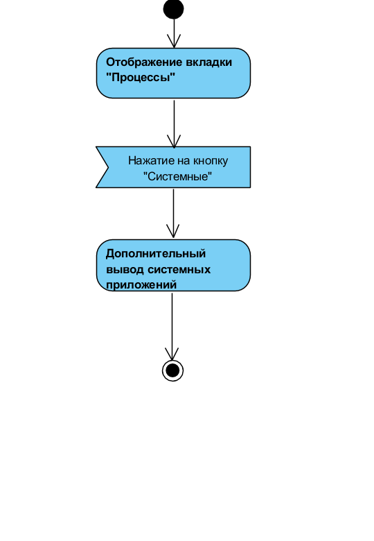
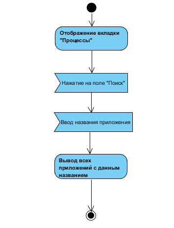
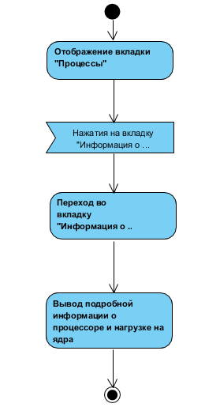
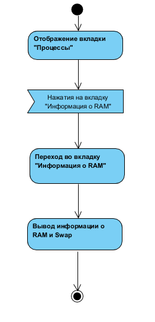

# Содержание
1. [Отображение системных процессов](#1)
2. [Информация о системе](#2)
3. [Поиск процесса](#3)
4. [Информация о процессоре](#4)
5. [Информация о RAM](#5)
6. [Завершения процесса](#6)

### 1. Отображение системных процессов
При открытии приложения, отображается вкладка Процессы, в которой видны все запущенные пользователем процессы.

### 2. Информация о системе
При нажатии на кнопку "Добавить", откроется страница с формой для добавления объявления.

  
### 3. [Поиск процесса
При нажатии на окно "Поиск" и ввода названия, выводятся все приложения с данным названием.

### 4. Информация о процессоре
При нажатии на вкладку "CPU" откроется вкладка "CPU", в которой будет отображаться информается о процессоре.

### 5. Информация о RAM
При нажатии на вкладку "RAM" откроется вкладка "RAM", в которой будет отображаться информается о оперативной памяти и swap.

### 6. Завершения процесса
При выборе процесса, нажатия завершения и подтверждения, процесс завершается.

