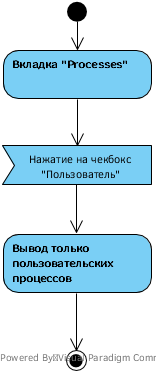
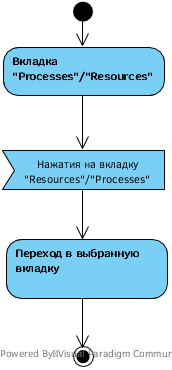
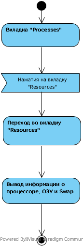
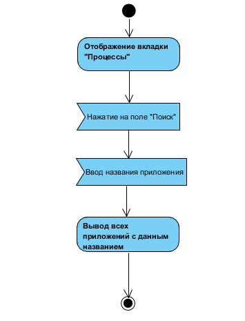
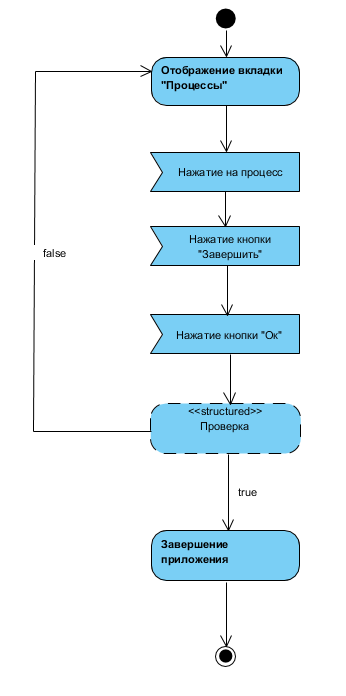

# Содержание
1. [Отображение пользовательских процессов](#1)
2. [Переход на другую вкладку](#2)
3. [Информация о процессоре, ОЗУ и Swap](#3)
4. [Поиск процесса](#4)
5. [Завершения процесса](#5)

### 1. Отображение пользовательских процессов
При нажатии чекбокса Пользователь, отображается вкладка Processes, в которой видны все запущенные пользователем процессы и скрыты системные.

### 2. Переход на другую вкладку 
При нажатии на вкладку "Processes"/"Resources" происходит переход в выбранную вкладку.

### 3. Информация о процессоре, ОЗУ и Swap 
При нажатии на вкладку "CPU" откроется вкладка "CPU", в которой будет отображаться информается о процессоре.

  
### 4. Поиск процесса 
При нажатии на окно "Поиск" и ввода названия, выводятся все приложения с данным названием.

### 5. Завершения процесса
При выборе процесса, нажатия завершения и подтверждения, процесс завершается.

