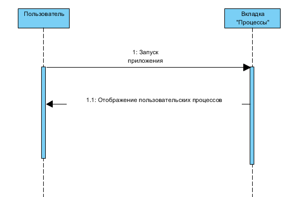
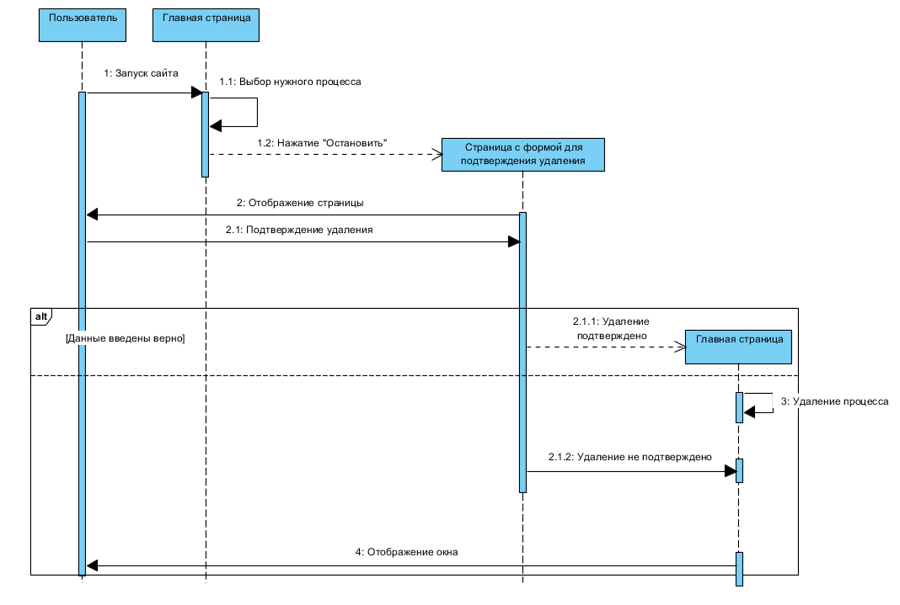
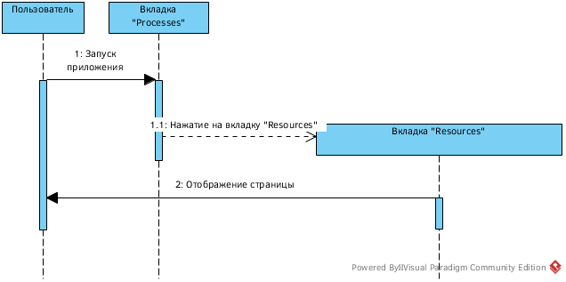

# Диаграммы последовательности
---

# Содержание
1. [Просмотр информации о процессах](#1)
2. [Поиск процесса по названию](#2)
3. [Остановка/Закрытие приложения](#3)
4. [Просмотр информации о процессоре, ОЗУ и Swap](#4)

### 1. Просмотр информации о процессах

### 2. Поиск процесса по названию

  
### 3. Остановка/Закрытие приложения

### 4. Просмотр информации о процессоре, ОЗУ и Swap

