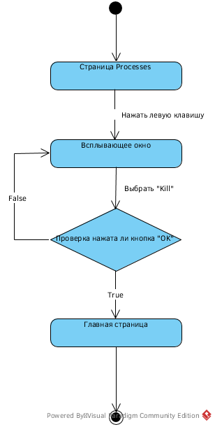
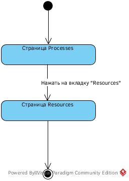
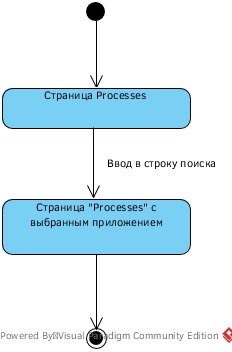

# Диаграммы состояния
---

# Содержание
1. [Завершение приложения](#1)
2. [Завершение одного потока приложения](#2)
3. [Переход в другую вкладку](#3)
4. [Поиск](#4)

### 1. Завершение приложения

### 2. Завершение одного потока приложения

  
### 3. Переход в другую вкладку

### 4. Поиск

