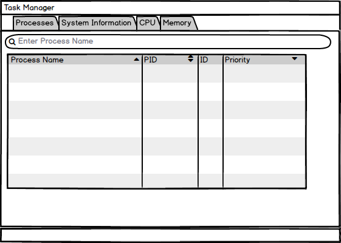
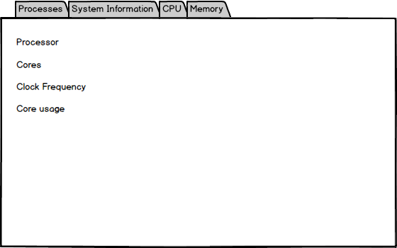
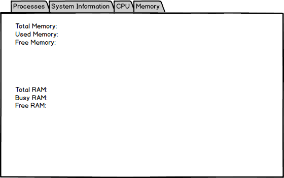

# Требования к проекту
---
# Содержание
1. [Введение](#intro)  
 	1.1 [Назначение](#appointment)  
  	1.2   [Бизнес-требования](#business_requirements)  
  	1.2.1 [Исходные данные](#initial_data)  
  	1.2.2 [Возможности бизнеса](#business_opportunities)  
  	1.2.3 [Границы проекта](#project_boundary)  
  	1.3   [Аналоги](#analogues)  
  	
  2. [Требования пользователя](#user_requirements)  
  	2.1 [Программные интерфейсы](#software_interfaces)  
  	2.2 [Интерфейс пользователя](#user_interface)  
  	2.3 [Характеристики пользователей](#user_specifications)  
  	2.3.1 [Классы пользователей](#user_classes)  
  	2.3.2 [Аудитория приложения](#application_audience)  
  	2.3.2.1 [Целевая аудитория](#target_audience)  
  	2.3.2.1 [Побочная аудитория](#collateral_audience)  
  	2.4 [Предположения и зависимости](#assumptions_and_dependencies)
   
  3. [Системные требования](#system_requirements)  
  	3.1 [Функциональные требования](#functional_requirements)  
  	3.1.1 [Основные функции](#main_functions)  
  	3.1.1.1 [Вход пользователя в приложение](#user_login_to_the_application)  
  	3.1.2 [Ограничения и исключения](#restrictions_and_exclusions)  
  	3.2 [Нефункциональные требования](#non-functional_requirements)  
  	3.2.1 [Атрибуты качества](#quality_attributes)  
  	3.2.1.1 [Требования к удобству использования](#requirements_for_ease_of_use)  
  	3.2.1.2 [Требования к безопасности](#security_requirements)  
  	3.2.1.3 [Требования к производительности](#performance_requirements)  
  	3.2.2 [Внешние интерфейсы](#external_interfaces)  
  	3.2.3 [Ограничения](#restrictions)  

<a name="intro"/>

# 1 Введение

<a name="appointment"/>

## 1.1 Назначение
Десктопное приложение "Диспетчер задач" предназначено для мониторинга за состоянием системы и запущенных приложений. Приложение создано для пользователей ОС Linux.

<a name="business_requirements"/>

## 1.2 Бизнес-требования

<a name="initial_data"/>

### 1.2.1 Исходные данные
Диспетчер задач является сильным инструментом, который поможет понять почему ваш компьютер тормозит, поможет убрать лишнее с запущенных процессов и вернуть быстродействие вашего компьютера.

<a name="business_opportunities"/>

### 1.2.2 Возможности бизнеса
Данное приложение будет пользоваться популярностью у современного человека.

<a name="project_boundary"/>

### 1.2.3 Границы проекта
Приложение позволит закрывать приложения, просматривать информацию о системе, о текущем состоянии процессора, оперативной памяти и диска.

<a name="analogues"/>

## 1.3 Аналоги

KTop для KDE3

System Activity для KDE 4

System Monitor для GNOME

Xfce Task Manager для Xfce

LXTask (LXDE)

<a name="user_requirements"/>

# 2 Требования пользователя

<a name="software_interfaces"/>

## 2.1 Программные интерфейсы
Приложение использует C++. В основе приложения - стандартные библиотеки C++ и Qt.

<a name="user_interface"/>

## 2.2 Интерфейс пользователя
  # Главное окно приложения.
  При нажатии на поле "Search",ввода названия приложения выполняется поиск приложения в списке запущенных.
  
  

  # Окно информации о процессоре.
  При нажатии на кнопку CPU происходит переход во вкладку CPU в которой выводится подробная информация о процессоре(количество ядер,тактовая частота, нагрузка в процентах).
  
  

  # Окно информации о диске и оперативной памяти.
  При нажатии на кнопку Memory происходит переход во вкладку Memory в которой выводится подробная информация о диске и текущем состоянии оперативной памяти.
  
  

<a name="user_specifications"/>

## 2.3 Характеристики пользователей

<a name="user_classes"/>

### 2.3.1 Классы пользователей

Пользователи, которые вошли в приложение имеют доступ к полному функционалу.

<a name="application_audience"/>

### 2.3.2 Аудитория приложения

<a name="target_audience"/>

#### 2.3.2.1 Целевая аудитория
Люди всех возрастных категорий.
<a name="collateral_audience"/>

#### 2.3.2.2 Побочная аудитория
Люди младшей и старшей возрастных категорий, обладающие минимальной технической грамотностью.

<a name="assumptions_and_dependencies"/>

## 2.4 Предположения и зависимости
1. Приложение работает некорректно если не установлен webkit2gtk

<a name="system_requirements"/>

# 3 Системные требования

<a name="functional_requirements"/>
 1. Библиотека libprocps-dev

## 3.1 Функциональные требования

<a name="main_functions"/>

### 3.1.1 Основные функции

<a name="user_login_to_the_application"/>

#### 3.1.1.1 Вход пользователя в приложение

  | Функция | Требования |
  | :----|:---|
  | Вход в приложение | Приложение должно предоставить пользователю список запущенных процессов. Пользователь должен либо выбрать из списка процесс и для закрытия приложения, либо выбрать другую необходимую ему вкладку |
  | Вывод информации о системе | Приложение выводит информацию о системе и оборудовании компьютера |
  | Вывод информации о процессоре | Приложение выводит подробную информацию о процессоре|
  | Вывод информации о дисках и оперативной памяти | Приложение выводит информацию о памяти диска и оперативной памяти компьютера |

<a name="restrictions_and_exclusions"/>

### 3.1.2 Ограничения и исключения
1. Приложение работает только на ОС Linux;

<a name="non-functional_requirements"/>

## 3.2 Нефункциональные требования

<a name="quality_attributes"/>

### 3.2.1 Атрибуты качества

<a name="requirements_for_ease_of_use"/>

#### 3.2.1.1 Требования к удобству использования
1. Доступ к основным функциям приложения не более чем за две операции;
2. Все функциональные элементы пользовательского интерфейса имеют названия, описывающие действие, которое произойдет при выборе элемента;
3. Пошаговая инструкция использования основных функций приложения отображена в справке;

<a name="security_requirements"/>

#### 3.2.1.2 Требования к безопасности
Приложение будет выдавать предупреждение при попытке закрытия системного приложения.

<a name="performance_requirements"/>

#### 3.2.1.3 Требования к производительности
При наличии процессора Intel Pentium, видеокарты GT GeForce 720M и 4GB оперативной памяти DDR3, скорость обновления окон приложения будет - 0,05 сек.

<a name="external_interfaces"/>

### 3.2.2 Внешние интерфейсы
Окна приложения удобны для использования пользователями с плохим зрением:
  * размер шрифта не менее 14пт;
  * функциональные элементы контрастны фону окна.

<a name="restrictions"/>

### 3.2.3 Ограничения
1. Приложение реализовано под платформу Linux;
