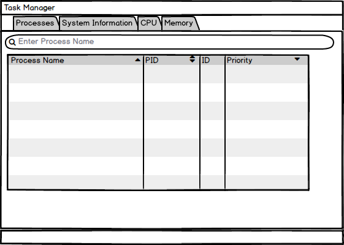
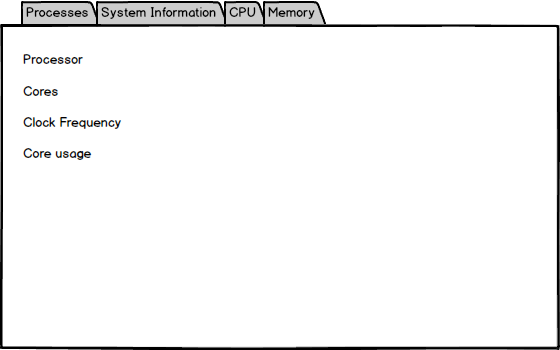

# Mockups
---

# Содержание
1. [Просмотр информации о процессах](#1)
2. [Просмотр информации о процессоре](#2)
3. [Просмотр информации о памяти](#3)

### 1. Просмотр информации о процессах 

 

### 2. Просмотр информации о процессоре 

 

### 3. Просмотр информации о памяти 

 
